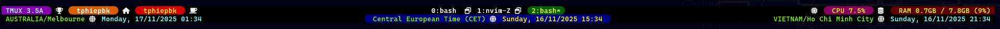

# tmux-double-status-bar

Polished double status bar



## Installation with Tmux Plugin Manager (recommended)


Add plugin to the list of TPM plugins:

```tmux.conf
set -g @plugin 'tphiepbk/tmux-double-status-bar'
```

Use `prefix` + <kbd>I</kbd> to install it.

## License

[MIT](LICENSE)
