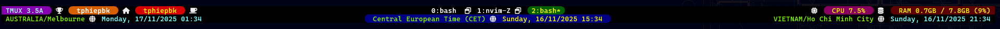

# tmux-double-status-bar

Polished double status bar



## Installation with Tmux Plugin Manager (recommended)

Add plugin to the list of TPM plugins:

```
set -g @plugin 'tphiepbk/tmux-double-status-bar'
```

Use `prefix` + <kbd>I</kbd> to install it.

## Options

```
# Set the separator style to "half_round" (default)
set-option -g @double-status-bar-separator-style 'half_round'

# Set the separator style to "triangle"
set-option -g @double-status-bar-separator-style 'triangle'

# Set the separator style to "slope"
set-option -g @double-status-bar-separator-style 'slope'
```

## License

[MIT](LICENSE)
